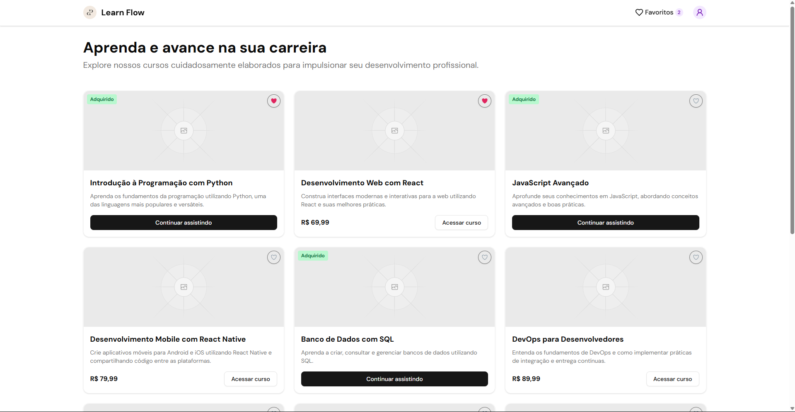

# Learn Flow

Learn Flow é uma plataforma de cursos online projetada para ajudar os usuários a aprender novas habilidades e avançar em suas carreiras. Explore uma variedade de cursos cuidadosamente elaborados para impulsionar seu desenvolvimento profissional.



## ✨ Tecnologias Utilizadas

Este projeto foi construído utilizando as seguintes tecnologias:

*   **Framework Principal:** [Next.js](https://nextjs.org/) (v15.3.2) com [Turbopack](https://turbo.build/pack)
*   **Linguagem:** [TypeScript](https://www.typescriptlang.org/) (v5)
*   **Gerenciador de Pacotes:** [pnpm](https://pnpm.io/)
*   **UI & Componentes:**
    *   [React](https://react.dev/) (v19)
    *   [Lucide React](https://lucide.dev/) (Ícones)
    *   [Radix UI](https://www.radix-ui.com/) (Primitivas de UI acessíveis)
    *   [Sonner](https://sonner.emilkowal.ski/) (Notificações/Toasts)
*   **Estilização:**
    *   [Tailwind CSS](https://tailwindcss.com/) (v4)
    *   `tailwind-merge`
    *   `tw-animate-css`
*   **Gerenciamento de Estado:** [Zustand](https://zustand-demo.pmnd.rs/) (v5.0.4)
*   **Animação:** [Rive React Canvas](https://rive.app/react)
*   **Linting & Formatting:** [Biome](https://biomejs.dev/)
*   **Deployment:** [Vercel](https://vercel.com/)

## 🚀 Começando

Siga estas instruções para configurar e rodar o projeto localmente.

### Pré-requisitos

*   [Node.js](https://nodejs.org/) (LTS recomendado - verifique a versão usada pelo Next.js 15 se necessário)
*   [pnpm](https://pnpm.io/installation) (gerenciador de pacotes)

### Clonando o Repositório

```bash
git clone https://github.com/HenriqueBragaMoreira/learn-flow
cd learn-flow
```

### Instalando as Dependências

Use o pnpm para instalar todas as dependências do projeto:

```bash
pnpm install
```

### Rodando a Aplicação em Desenvolvimento

Para iniciar o servidor de desenvolvimento (com Turbopack, conforme configurado):

```bash
pnpm dev
```

### Abrindo no Navegador

Após iniciar o servidor, abra seu navegador e acesse:

[http://localhost:3000](http://localhost:3000)

Você deverá ver a página inicial da aplicação Learn Flow. Agora você pode começar a explorar e modificar o código!

## 🛠️ Outros Scripts Úteis

O `package.json` contém outros scripts que podem ser úteis:

*   `pnpm build`: Compila a aplicação para produção.
*   `pnpm start`: Inicia o servidor de produção (após o `build`).
*   `pnpm lint`: Executa o linter do Next.js.
*   `pnpm check`: Verifica o código com Biome.
*   `pnpm format`: Formata o código com Biome.
*   `pnpm type-check`: Verifica os tipos com TypeScript.

